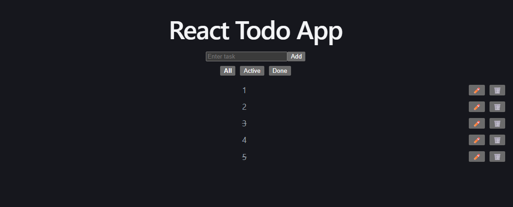

# React Todo App

Simple Todo application built with React and Vite.

## 🚀 Features

- Add tasks
- Delete tasks
- Edit tasks
- Mark tasks as done / undone
- Filter tasks (All / Active / Done)
- Persistent storage using localStorage

## 🧠 What I learned

- React useState and useEffect
- CRUD operations in React
- State management best practices
- Conditional rendering
- Working with localStorage
- Git workflow (branches, merge, commits)

## 🛠️ Tech Stack

- React
- JavaScript (ES6+)
- Vite
- HTML/CSS (inline styling)

## ▶️ How to run locally

```bash
npm install
npm run dev
```

## 📸 Preview


